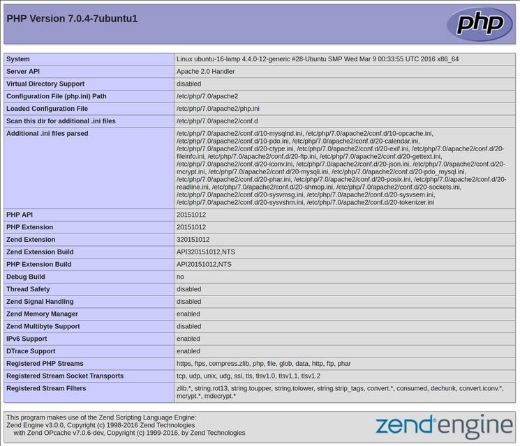

# Thiết lập môi trường: composer, php, mysql

## I. PHP & MYSQL

### 1. Cài đặt MySQL

chạy lệnh (trên ubuntu 16.04):
```
$ sudo apt-get update
$ sudo apt-get install mysql-server
```

Trong khi cài đặt, máy chủ của bạn sẽ yêu cầu bạn chọn và xác nhận mật khẩu cho "root" user MySQL. Đây là một tài khoản quản trị trong MySQL đặc quyền. Hãy nghĩ về nó như là tương tự như các tài khoản gốc cho các máy chủ Hãy chắc chắn rằng đây là mật khẩu mạnh mẽ, duy nhất, và không để trống.

### 2. Cài đặt PHP

chạy lệnh (trên ubuntu 16.04):
```
$ sudo apt-get update
$ sudo apt-get install php libapache2-mod-php php-mcrypt php-mysql
```
**Kiểm tra lại xử lý PHP trên máy của bạn**

Bạn có thể kiểm tra PHP đã được cài đặt hay chưa bằng Terminal bằng cách gõ lệnh `php -v`. Sẽ trả kết quả là thông tin phiên bản PHP hiện tại của bạn.

**Ngoài ra**: Sau khi bạn cài đặt Apache hoặc Ngix thì sẽ có một thư mục thực thi khi các bạn vào `localhost`. Với Ubuntu, thư mục này nằm ở `/var/www/html/`. Chúng ta có thể tạo ra các tập tin tại vị trí đó bằng cách gõ:
```
$ sudo nano /var/www/html/info.php
```
bạn viết vào đó:
```
<?php phpinfo(); ?>
```
Sau khi hoàn thành hãy lưu và đóng lại.
Bây giờ bạn mở trình duyệt lên và gõ đưỡng dẫn:
```
http://localhost/info.php
```
nếu kết quả tuơng tự như dưới là thành công: 


## II. COMPOSER. 

Trước khi Composer ra đời, chúng ta thường khó chịu với hàng tá các thư viện của bên thứ ba cần phải quản lý, rất khó khăn để cập nhật và còn lại các khâu cài đặt lằng quằng. Đó là quá khứ thôi, sự ra đời của Composer đã làm thay đổi hoàn toàn mọi thứ rồi. Trong bài viết này chúng ta sẽ tìm hiểu về Composer thực chất nó là gì.


### 1. Composer là gì ?

**Composer** là một công cụ quản lý các thư viện trong PHP (Dependency Management), công cụ này giúp ta tiết kiệm khá
nhiều thời gian với các gói thư viện cần thiết mà project của bạn cần sử dụng, bạn chỉ cần khai báo nó, composer sẽ tự
động tải code của các thư viện về thông qua một server cộng đồng.

**Composer** giúp ta quản lý thư viện một cách chuyên biệt từng project không giống như APT hay YUM (linux) dùng chungmà nó tương tự như npm của NodeJS, tức là ví dụ bạn có PROJECT A và PROJECT B thì nếu bạn cần thư viện LIB X thì khi cài đặt thư viện LIB X sẽ được thêm ngay vào trong từng thư mục PROJECT A và PROJECT B. Hoặc bạn cũng có thể cài đặt thư viện LIB X ở riêng PROJECT A thì PROJECT B sẽ không có LIB X này mà chỉ có PROJECT A có.

**Composer** là một mã nguồn mở (OpenSource) nên được cộng đồng hỗ trợ rất nhiều, bạn có thể tham gia phát triển, phát triển lại từ trang [Github chính thức của Composer.](https://github.com/composer/composer)


### 2. Tại sao lại cần Composer ?
       
Như mình đã nói ở trên **Composer** ra đời để giải quyết các vấn đề khó khăn như dung lượng project sẽ lơn hơn, việc cập nhật cũng như thêm thư viện vào project rất phức tạp và phiền phức. Với **composer**, bạn sẽ cần khai báo tên và version của các thư viện mà bạn có sử dụng mà không cần phải tự tay chép code của nó vào project, **composer** sẽ tự động tìm và tải thư viện mà bạn cần trên Server, nếu trong thư viện đó có dùng các thư viện khác thì nó cũng sẽ tải các thư viện khác về, nó đệ quy cho đến khi tải đủ các thư viện, thật tuyệt vời phải không nào.


### 3. Hướng dẫn cài đặt Composer (ubuntu 16.04)

Trước khi cài đặt Composer, chúng ta phải chắc rằng phải có các thành phần phụ thuộc.

Đầu tiên, cập nhật package manager cache bằng cách chạy:
```
$ sudo apt-get update
```

Bây giờ, chúng ta cài đặt những thành phần phụ thuộc. `curl` để tải Composer và `php-cli` để cài đặt và chạy nó.  Gói php-mbstring là cần thiết cung cấp thư viện sử dụng. git được Composer sử dụng theo dự án và unzip để giải nén. Tất cả được cài đặt bằng lệnh:
```
sudo apt-get install curl php-cli php-mbstring git unzip
```

Tiến hành cài đặt Composer:
```
$ cd ~
$ curl -sS https://getcomposer.org/installer -o composer-setup.php
```

Tiếp theo, chạy một kịch bản PHP ngắn để xác minh rằng trình cài đặt phù hợp với máy bạn. Thay `Installer Signature` bằng [Composer Public Keys / Signatures](https://composer.github.io/pubkeys.html)
```
$ php -r "if (hash_file('SHA384', 'composer-setup.php') === 'Installer Signature') { echo 'Installer verified'; } else { echo 'Installer corrupt'; unlink('composer-setup.php'); } echo PHP_EOL;"
```
*Output* `Installer verified` là thành công. Và bạn có thể sử dụng Composer trong thư mục đó. Muốn sử dụng câu lệnh Composer ở bất cứ đâu bạn chạy câu lệnh:
```
$ sudo php composer-setup.php --install-dir=/usr/local/bin --filename=composer
```
Để kiểm tra cài đặt Composer của bạn chạy:
```
$ composer
```
Và bạn sẽ nhận được output tương tự như sau:
```
  ______
  / ____/___  ____ ___  ____  ____  ________  _____
 / /   / __ \/ __ `__ \/ __ \/ __ \/ ___/ _ \/ ___/
/ /___/ /_/ / / / / / / /_/ / /_/ (__  )  __/ /
\____/\____/_/ /_/ /_/ .___/\____/____/\___/_/
                    /_/
Composer version 1.1.1 2016-05-17 12:25:44

Usage:
  command [options] [arguments]

Options:
  -h, --help                     Display this help message
  -q, --quiet                    Do not output any message
  -V, --version                  Display this application version
      --ansi                     Force ANSI output
      --no-ansi                  Disable ANSI output
  -n, --no-interaction           Do not ask any interactive question
      --profile                  Display timing and memory usage information
      --no-plugins               Whether to disable plugins.
. . .
```
Điều này có nghĩa Composer đã được cài đặt thành công vào hệ thống của bạn.
